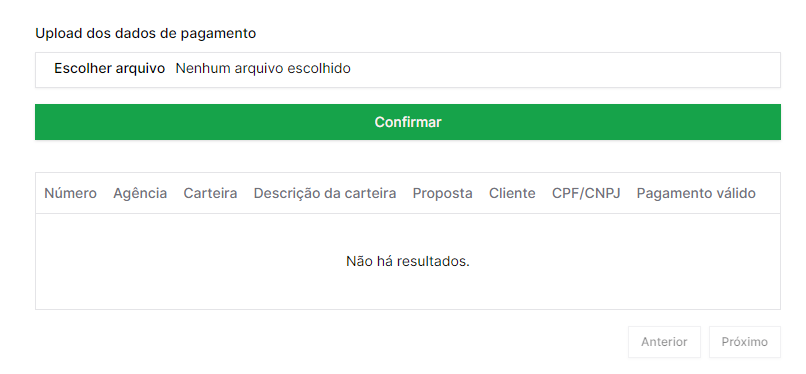

## Instructions

### Backend

- With docker

  - Just open your terminal and run `docker compose up -d` and be happy

- Locally

  - Install the dependencies using a package manager of your choice, for example: `npm run install`, then execute the project with: `npm run start:dev`

### Frontend

Install the dependencies using a package manager of your choice, for example: `npm run install`, then execute the project with: `npm run dev`

You can use the mock csv files from this repository to test the application

### Screenshots

## Important notes

Don't forget to create a .env file using the .env.example file as sample in the backend, also if you are executing the project locally, use **localhost** as the host for redis and mongo database url.
